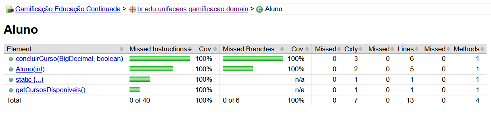
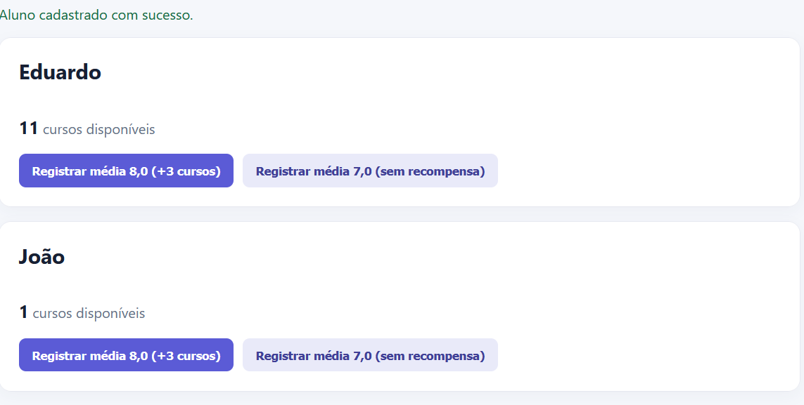
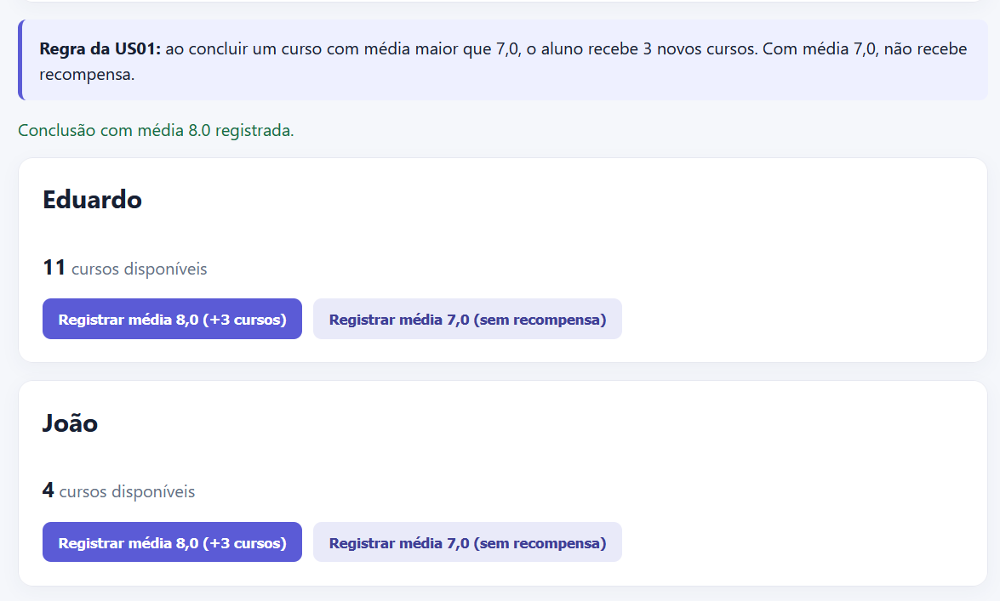
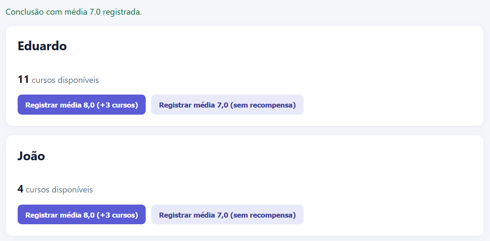
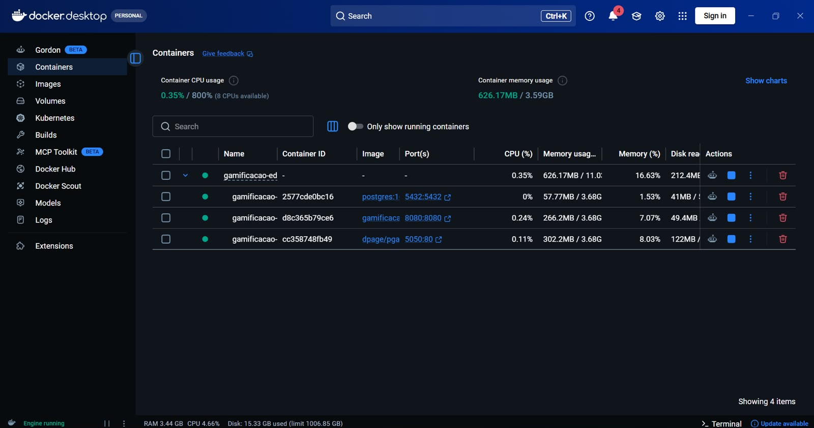

# Aprende+ ÔÇö Educa├º├úo Continuada Gamificada

> Projeto acad├¬mico ÔÇö ATDD, BDD e TDD | Entrega via GitHub

## Descrição do estudo de caso

Uma plataforma de cursos online/EAD funciona por assinatura. O aluno inicia no plano B├ísico e, ao concluir um curso com m├®dia **maior que 7,0**, recebe acesso a tr├¬s novos cursos. A participa├º├úo de destaque no f├│rum rende um curso adicional ao final do m├¬s. Ao conquistar 12 cursos, o aluno passa para o plano Premium e recebe tr├¬s moedas, que poder├úo ser acumuladas ou convertidas em benef├¡cios.

O **Aprende+** implementa essas regras de gamificação. O projeto usa ATDD: os cenários BDD definem o comportamento esperado e os testes TDD validam as regras antes e durante a implementação.

## Integrantes e user stories

| Integrante | RA | User story redigida |
| --- | ---: | --- |
| Eduardo Bismara Nastri | 211466 | **US02** ÔÇö Como aluno, quero ser recompensado pela minha participa├º├úo e ajuda no f├│rum para ser incentivado a colaborar. |
| Khevyn Henrique Guedes T. Alves | 223761 | **US03** ÔÇö Como aluno, quero ter minha assinatura atualizada para Premium ao conquistar 12 cursos para receber benef├¡cios exclusivos. |
| Jo├úo Victor Cardoso Engler Rizzi de Araujo | 236602 | **US01** ÔÇö Como aluno, quero desbloquear 3 novos cursos ao concluir um curso com m├®dia acima de 7,0 para continuar meus estudos. |

### User story escolhida para a implementação central

**US01 ÔÇö Jo├úo Victor Cardoso Engler Rizzi de Araujo (RA 236602).**

Crit├®rios de aceita├º├úo (BDD), tamb├®m dispon├¡veis em [docs/gamificacao.feature](docs/gamificacao.feature):

1. Com 5 cursos dispon├¡veis, a conclus├úo com m├®dia 8,0 libera 3, totalizando 8.
2. A conclus├úo com m├®dia 7,0 ou menor n├úo libera cursos.
3. Um curso que ainda está em andamento não gera recompensa.

**Escopo implementado nesta entrega:** somente a US01. As US02 e US03 estão descritas como backlog e reservadas para implementação individual de Eduardo e Khevyn, respectivamente.

## BDD: cenários e responsáveis

Os cenários estão em [docs/gamificacao.feature](docs/gamificacao.feature). A identificação a seguir atende à atribuição individual dos BDDs.

| Responsável | User story | Cenários BDD redigidos |
| --- | --- | --- |
| Jo├úo Victor Cardoso Engler Rizzi de Araujo ÔÇö RA 236602 | US01 | Desbloqueio com m├®dia maior que 7; m├®dia igual a 7 n├úo libera cursos; curso em andamento n├úo libera cursos. |
| Eduardo Bismara Nastri ÔÇö RA 211466 | US02 | A redigir e implementar: premia├º├úo mensal para aluno mais participativo do f├│rum. |
| Khevyn Henrique Guedes T. Alves ÔÇö RA 223761 | US03 | A redigir e implementar: mudan├ºa para plano Premium ao atingir 12 cursos e cr├®dito de tr├¬s moedas. |

Exemplo do cenário principal (US01):

```gherkin
Cen├írio: Desbloquear cursos ap├│s conclus├úo com boa m├®dia
  Dado que o aluno possui 5 cursos disponíveis
  Quando concluir um curso com m├®dia final 8,0
  Então o sistema deve liberar 3 novos cursos
  E o aluno deve visualizar 8 cursos disponíveis
```
A planilha original da atividade está preservada em [docs/ATDD-Case-AC1.xlsx](docs/ATDD-Case-AC1.xlsx).

## Estrutura e camadas

```text
src/main/java/br/edu/unifacens/gamificacao/
Ôö£ÔöÇÔöÇ domain/       # regras de neg├│cio puras e seus testes TDD
Ôö£ÔöÇÔöÇ entity/       # persist├¬ncia JPA
Ôö£ÔöÇÔöÇ repository/   # acesso aos dados
Ôö£ÔöÇÔöÇ service/      # orquestra o caso de uso
Ôö£ÔöÇÔöÇ dto/          # contratos da API
ÔööÔöÇÔöÇ controller/   # endpoints REST documentados no Swagger
```

## TDD: RED  GREEN  BLUE

O teste principal está em `src/test/java/.../domain/AlunoTest.java`.

- **RED:** criar o teste `desbloqueiaTresCursosQuandoConcluiComMediaMaiorQueSete`; antes de existir `Aluno.concluirCurso`, ele falha por não haver implementação.
- **GREEN:** implementar o m├¡nimo em `Aluno.concluirCurso` para liberar tr├¬s cursos quando a m├®dia for maior que 7,0.
- **BLUE:** refatorar a regra da US01 (curso em andamento e m├®dia limite), mantendo todos os testes verdes e cobertura de linhas do pacote `domain` em 100%.

Para a evidência formal, os commits devem ser feitos nesta sequência, sem deixar falhas na branch `main`:

```bash
git commit -m "test(red): especifica desbloqueio de cursos"
git tag evidencia-tdd-red
git commit -m "feat(green): desbloqueia cursos por m├®dia"
git tag evidencia-tdd-green
git commit -m "refactor(blue): consolida regras de gamificação"
git tag evidencia-tdd-blue
```

Execute a evidência de testes e cobertura:

```bash
mvn clean verify
```

O relat├│rio fica em `target/site/jacoco/index.html`. O JaCoCo exige 100% das linhas e decis├Áes (branches) do pacote `domain`, sem itens amarelos ou vermelhos nesse relat├│rio. Na vers├úo atual, `mvn clean verify` executa os testes de dom├¡nio e valida essa meta automaticamente.


## Evidências para a entrega

| Evidência exigida | Localização / Comprovação | Status |
| --- | --- | --- |
| **BDD** | Arquivo `docs/gamificacao.feature` e planilha anexada | US01 implementada; US02 e US03 aguardam os responsáveis |
| **RED, GREEN e BLUE** | Histórico de commits/tags e screenshots abaixo | Concluído (US01) |
| **Testes e cobertura** | Relatório JaCoCo (`target/site/jacoco/index.html`) | Validado: 100% do domínio atendido |

### Fase RED
Testes criados antes da implementa├º├úo falhando, garantindo que a regra de neg├│cio ├® necess├íria.


###  Fase GREEN
Implementação mínima para fazer os testes passarem.


###  Fase BLUE e Cobertura (JaCoCo)
Refatoração do código (Clean Code e remoção de Magic Numbers) mantendo os testes passando, junto com a comprovação de 100% de cobertura pelo JaCoCo.



---
Fase de Integração

Demonstração da User Story 01 validada ponta a ponta, processando as regras de negócio via API integrada à interface.

1. Estado Inicial:
   Aluno cadastrado e com saldo original de 1 curso disponível.


2. Sucesso (M├®dia > 7.0):
   Ap├│s registrar a conclus├úo de um curso com m├®dia 8,0, a regra de neg├│cio libera 3 novos cursos. 1 saldo ├® atualizado corretamente para 4.


3. Trava de Seguran├ºa (M├®dia <= 7.0):
   Ao registrar a conclus├úo de outro curso com m├®dia 7,0, o sistema recusa a recompensa, mantendo o saldo de cursos intacto (4).


---
## US03 — Plano Premium (Khevyn)

A US03 promove automaticamente o aluno do plano **BASICO** para **PREMIUM** quando o total de cursos concluídos chega a **12**. Na promoção, o aluno recebe **3 moedas**. Se já estiver Premium, novas conclusões não duplicam essa premiação.

O ciclo TDD da US03 foi registrado em commits separados:

- `test(red): especifica plano Premium da US03`
- `feat(green): implementa plano Premium e moedas da US03`
- `refactor(blue): consolida regras e cobertura da US03`

Os testes de domínio cobrem o cenário de promoção, o limite anterior aos 12 cursos e a proteção contra moedas duplicadas. A validação final foi executada pelo GitHub Actions com:

```bash
mvn clean verify
```

O relatório JaCoCo confirmou **100% de cobertura de instruções e 100% de branches** no pacote `domain`. O workflow `.github/workflows/us03-jacoco.yml` publica o relatório como artefato `jacoco-us03`.

A contribuição individual da US03 está registrada no [Pull Request #1](https://github.com/EnglerEngler/gamificacao-educacao-continuada/pull/1).
## Como executar o projeto (Docker)

O projeto usa o mesmo padr├úo apresentado em aula: aplica├º├úo Spring Boot, PostgreSQL e pgAdmin em containers separados. O Dockerfile compila o frontend Vue e o backend dentro da imagem, portanto n├úo ├® necess├írio executar Maven ou npm antes.

1. Certifique-se de que o Docker Desktop esteja aberto e que a integração WSL esteja ativa.
2. Na raiz do projeto, execute:

```bash
docker compose up --build
```

3. Aguarde o log da aplicação informar que iniciou na porta 8080. O Compose espera o healthcheck do PostgreSQL antes de iniciar a API.

### Acessos Docker

- Aplicação e frontend Vue: `http://localhost:8080`
- Swagger: `http://localhost:8080/swagger-ui.html`
- PostgreSQL: porta `5432`, banco/usuário/senha `gamificacao`
- pgAdmin: `http://127.0.0.1:5050` (ou `http://localhost:5050`)
  - e-mail: `admin@gamificacao.com`
  - senha: `admin`

No pgAdmin, registre o servidor com host `postgres`, porta `5432`, banco `gamificacao`, usuário `gamificacao` e senha `gamificacao`.

Para encerrar os containers:

```bash
docker compose down
```

Para apagar tamb├®m os dados do banco e recome├ºar do zero:

```bash
docker compose down -v
```

## Executar localmente com H2

```bash
mvn spring-boot:run
```

- API: `http://localhost:8080/api/alunos`
- Swagger: `http://localhost:8080/swagger-ui.html`
- Console H2: `http://localhost:8080/h2-console`

Para rodar o frontend Vue fora do Docker:

```bash
cd frontend
npm install
npm run dev
```
