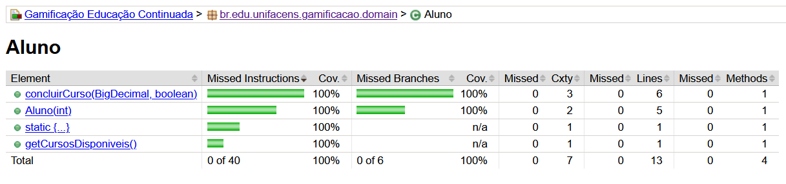

# Aprende+ — AC1 e B1 Architecture Lab

Entrega B1: seis decisões evolutivas, Core modular, domínio com Ports & Adapters, integração Python com fallback, eventos duráveis, MQTT e observabilidade.

**Comece pelo [registro arquitetural cumulativo](docs/arquitetura/README.md)**: identificação da equipe, RF/RNF/RPC, matriz de 18 ASRs (três por desafio), seis ADRs, C4 e síntese para a PoC da AF.

- [ADRs](docs/adr/ADR-001-core-modular.md), com alternativas e consequências.
- [Diagramas C4 e renderizações](docs/arquitetura/diagramas/README.md).
- [Evidências reais dos seis desafios](docs/evidencias/b1/README.md).
- [Roteiro de apresentação e entrega](docs/ENTREGA-B1.md).

Para executar os componentes B1 por containers:

```bash
docker compose -f docker-compose.yml -f docker-compose.b1.yml up --build -d
```

Para reproduzir o laboratório nativo no Ubuntu 24.04 sem Docker:

```bash
bash scripts/bootstrap-lab.sh
.venv/bin/python scripts/lab.py evidence
bash scripts/verify.sh
.venv/bin/python scripts/collect-test-evidence.py
```

Aplicação/Swagger: localhost:8080; Prometheus: localhost:9090; Grafana: localhost:3000 (admin / lab-b1-grafana). O Core continua com os endpoints da AC1 e aceita X-Instituicao (padrão ac1). Para idempotência de conclusão, envie um cursoId estável; payload legado sem identidade representa nova conclusão a cada chamada.

Os serviços Python, gateway, broker e banco têm dados/artefatos separados. Credenciais versionadas são demonstrativas de localhost. O laboratório foi executado com processos reais e H2 persistente; empacotamento/deploy Docker está configurado, mas não foi apresentado como execução realizada quando Docker Desktop estava indisponível.

## Histórico da AC1

> Projeto acadêmico — ATDD, BDD e TDD | Entrega via GitHub

## Descrição do estudo de caso

Uma plataforma de cursos online/EAD funciona por assinatura. O aluno inicia no plano Básico e, ao concluir um curso com média **maior que 7,0**, recebe acesso a três novos cursos. A participação de destaque no fórum rende um curso adicional ao final do mês. Ao conquistar 12 cursos, o aluno passa para o plano Premium e recebe três moedas, que poderão ser acumuladas ou convertidas em benefícios.

O **Aprende+** implementa essas regras de gamificação. O projeto usa ATDD: os cenários BDD definem o comportamento esperado e os testes TDD validam as regras antes e durante a implementação.

## Integrantes e user stories

| Integrante | RA | User story redigida |
| --- | ---: | --- |
| Eduardo Bismara Nastri | 211466 | **US02** — Como aluno, quero ser recompensado pela minha participação e ajuda no fórum para ser incentivado a colaborar. |
| Khevyn Henrique Guedes T. Alves | 223761 | **US03** — Como aluno, quero ter minha assinatura atualizada para Premium ao conquistar 12 cursos para receber benefícios exclusivos. |
| João Victor Cardoso Engler Rizzi de Araujo | 236602 | **US01** — Como aluno, quero desbloquear 3 novos cursos ao concluir um curso com média acima de 7,0 para continuar meus estudos. |

### User story escolhida para a implementação central

**US01 — João Victor Cardoso Engler Rizzi de Araujo (RA 236602).**

Critérios de aceitação (BDD), também disponíveis em [docs/gamificacao.feature](docs/gamificacao.feature):

1. Com 5 cursos disponíveis, a conclusão com média 8,0 libera 3, totalizando 8.
2. A conclusão com média 7,0 ou menor não libera cursos.
3. Um curso que ainda está em andamento não gera recompensa.

**Escopo da AC1:** somente a US01. O B1 reaproveita essa regra e acrescenta conquistas/Premium, ranking e integrações. A recompensa de participação no fórum (US02) continua fora dos mini-labs; não foi apresentada como implementada.

## BDD: cenários e responsáveis

Os cenários estão em [docs/gamificacao.feature](docs/gamificacao.feature). A identificação a seguir atende à atribuição individual dos BDDs.

| Responsável | User story | Cenários BDD redigidos |
| --- | --- | --- |
| João Victor Cardoso Engler Rizzi de Araujo — RA 236602 | US01 | Desbloqueio com média maior que 7; média igual a 7 não libera cursos; curso em andamento não libera cursos. |
| Eduardo Bismara Nastri — RA 211466 | US02 | A redigir e implementar: premiação mensal para aluno mais participativo do fórum. |
| Khevyn Henrique Guedes T. Alves — RA 223761 | US03 | A redigir e implementar: mudança para plano Premium ao atingir 12 cursos e crédito de três moedas. |

Exemplo do cenário principal (US01):

```gherkin
Cenário: Desbloquear cursos após conclusão com boa média
  Dado que o aluno possui 5 cursos disponíveis
  Quando concluir um curso com média final 8,0
  Então o sistema deve liberar 3 novos cursos
  E o aluno deve visualizar 8 cursos disponíveis
```

Guias individuais de contribuição: [Khevyn](docs/GUIA-KHEVYN.md) e [Eduardo](docs/GUIA-EDUARDO.md).


A planilha original da atividade está preservada em [docs/ATDD-Case-AC1.xlsx](docs/ATDD-Case-AC1.xlsx).

## Estrutura e camadas

```text
src/main/java/br/edu/unifacens/gamificacao/
├── domain/       # regras de negócio puras e seus testes TDD
├── entity/       # persistência JPA
├── repository/   # acesso aos dados
├── service/      # orquestra o caso de uso
├── dto/          # contratos da API
└── controller/   # endpoints REST documentados no Swagger
```

## TDD: RED → GREEN → BLUE

O teste principal está em `src/test/java/.../domain/AlunoTest.java`.

- **RED:** criar o teste `desbloqueiaTresCursosQuandoConcluiComMediaMaiorQueSete`; antes de existir `Aluno.concluirCurso`, ele falha por não haver implementação.
- **GREEN:** implementar o mínimo em `Aluno.concluirCurso` para liberar três cursos quando a média for maior que 7,0.
- **BLUE:** refatorar a regra da US01 (curso em andamento e média limite), mantendo todos os testes verdes e cobertura de linhas do pacote `domain` em 100%.

Para a evidência formal, os commits devem ser feitos nesta sequência, sem deixar falhas na branch `main`:

```bash
git commit -m "test(red): especifica desbloqueio de cursos"
git tag evidencia-tdd-red
git commit -m "feat(green): desbloqueia cursos por média"
git tag evidencia-tdd-green
git commit -m "refactor(blue): consolida regras de gamificação"
git tag evidencia-tdd-blue
```

Execute a evidência de testes e cobertura:

```bash
mvn clean verify
```

O relatório fica em `target/site/jacoco/index.html`. O JaCoCo exige 100% das linhas e decisões (branches) do pacote `domain`, sem itens amarelos ou vermelhos nesse relatório. Na versão atual, `mvn clean verify` executa os testes de domínio e valida essa meta automaticamente.


## Evidências para a entrega

| Evidência exigida | Localização / Comprovação | Status |
| --- | --- | --- |
| **BDD** | Arquivo `docs/gamificacao.feature` e planilha anexada | US01 implementada; US02 e US03 aguardam os responsáveis |
| **RED, GREEN e BLUE** | Histórico de commits/tags e screenshots abaixo | Concluído (US01) |
| **Testes e cobertura** | Relatório JaCoCo (`target/site/jacoco/index.html`) | Validado: 100% do domínio atendido |

### Fase RED
Testes criados antes da implementação falhando, garantindo que a regra de negócio é necessária.


###  Fase GREEN
Implementação mínima para fazer os testes passarem.


###  Fase BLUE e Cobertura (JaCoCo)
Refatoração do código (Clean Code e remoção de Magic Numbers) mantendo os testes passando, junto com a comprovação de 100% de cobertura pelo JaCoCo.



---

## Como executar o projeto (Docker)

O projeto usa o mesmo padrão apresentado em aula: aplicação Spring Boot, PostgreSQL e pgAdmin em containers separados. O Dockerfile compila o frontend Vue e o backend dentro da imagem, portanto não é necessário executar Maven ou npm antes.

1. Certifique-se de que o Docker Desktop esteja aberto e que a integração WSL esteja ativa.
2. Na raiz do projeto, execute:

```bash
docker compose up --build
```

3. Aguarde o log da aplicação informar que iniciou na porta 8080. O Compose espera o healthcheck do PostgreSQL antes de iniciar a API.

### Acessos Docker

- Aplicação e frontend Vue: `http://localhost:8080`
- Swagger: `http://localhost:8080/swagger-ui.html`
- PostgreSQL: porta `5432`, banco/usuário/senha `gamificacao`
- pgAdmin: `http://127.0.0.1:5050` (ou `http://localhost:5050`)
  - e-mail: `admin@gamificacao.com`
  - senha: `admin`

No pgAdmin, registre o servidor com host `postgres`, porta `5432`, banco `gamificacao`, usuário `gamificacao` e senha `gamificacao`.

Para encerrar os containers:

```bash
docker compose down
```

Para apagar também os dados do banco e recomeçar do zero:

```bash
docker compose down -v
```

## Executar localmente com H2

```bash
mvn spring-boot:run
```

- API: `http://localhost:8080/api/alunos`
- Swagger: `http://localhost:8080/swagger-ui.html`
- Console H2: `http://localhost:8080/h2-console`

Para rodar o frontend Vue fora do Docker:

```bash
cd frontend
npm install
npm run dev
```
