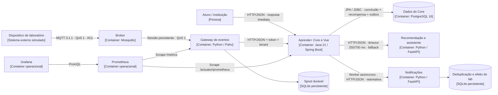

# B1 — Registro arquitetural vivo do Aprende+

**Documento único da entrega B1**, no caminho exigido pelo DOCX. [Desafios 1 a 6](../../labs/README.md) · [Evidências](../evidencias/b1/README.md).

## Entrega e equipe

Repositório: https://github.com/EnglerEngler/gamificacao-educacao-continuada
Produto: Aprende+ — Gamificação para Educação Continuada.
Baseline inicial da AC1 preservado em `labs/desafio1/baseline/`, commit `b31abd3`. A contribuição US03 da main (ef33fa7 / PR #1) também foi integrada ao módulo aluno, preservando testes e autoria.
Enunciado e ZIPs recebidos: [fontes originais](../fontes/README.md).

| Integrante | RA |
| --- | --- |
| Eduardo Bismara Nastri | 211466 |
| Khevyn Henrique Guedes T. Alves | 223761 |
| João Victor Cardoso Engler Rizzi de Araujo | 236602 |

A premissa de seis desenvolvedores é uma RPC do cenário acadêmico; a identificação acima reproduz a equipe registrada na AC1. Não foram fabricadas contribuições individuais.

## Objetivo e limites da entrega

O B1 pede seis decisões evolutivas sustentadas por microsoluções. O Core continua Java/Spring Boot e banco relacional, reutilizando a US01 da AC1: **média > 7,0**, não >= 7,0. Os ZIPs são exemplos didáticos do Desafio 1; não substituem a regra do nosso produto e não obrigam escolher determinada arquitetura.

A entrega executa ranking, conquistas, consulta Python, fallback, outbox/notificações e entrada MQTT. O recomendador usa ranking simples de tags; o assistente usa retrieval e resposta extrativa sobre material local, sem modelo treinado ou LLM externo. Esse recorte testa a fronteira, o protocolo e a falha de IA, conforme o mini-lab; não demonstra qualidade de ML/RAG em produção.

As evidências de operação foram produzidas com processos reais no WSL, usando H2 persistente em modo PostgreSQL, FastAPI, Mosquitto, Prometheus e Grafana. Docker Desktop estava indisponível; as configurações equivalentes de containers estão versionadas. O banco de produção previsto continua PostgreSQL. Os limites de cada medição estão registrados junto ao resultado.

## RFs e RPCs cumulativos

| RF | Comportamento observado | Endpoint/fluxo |
| --- | --- | --- |
| RF01 | Ranking por instituição, 100 pontos por aprovação + moedas; leitura limitada e ordem estável | `GET /api/ranking?limite=20&pagina=0` |
| RF02 | Recompensa AC1, badge de primeira aprovação e Premium/três moedas ao atingir 12 conclusões | `POST /api/alunos/{id}/cursos/conclusao` |
| RF03 | Recomendação por interesse, com catálogo local na falha de IA | `GET /api/ia/recomendacoes` |
| RF04 | Assistente educacional com fontes locais e resposta de indisponibilidade | `POST /api/ia/assistente` |
| RF05 | Notificação eventual de conclusão, sem bloquear o Core | Outbox → HTTP → consumidor idempotente |
| RF06 | Presença, início e conclusão de atividade via dispositivo simulado | MQTT → gateway durável → `POST /api/iot/eventos` |

RPCs globais: reaproveitar a AC1; Core Java/Spring Boot; banco relacional; limite operacional de equipe pequena. A base existente usa Java 21, mantido para evitar migração sem necessidade. PostgreSQL 16 é a implantação por containers; H2 é adapter de laboratório. A escolha de processo/deploy único do Core é uma **decisão**, não uma restrição inicial.

RPCs adicionais: Python para IA; IA indisponível não bloqueia operações essenciais; consumidor externo indisponível não bloqueia conclusão; dispositivos limitados/conexão intermitente; Jenkins como esteira e Prometheus/Grafana como ferramentas do lab; código, artefatos e configurações versionados.

## RNFs e seleção de ASRs

FURPS+: funcionalidades estão nos RFs; Reliability cobre tolerância a falhas, disponibilidade e recuperabilidade; Performance cobre latência/eficiência; Supportability cobre manutenibilidade, modificabilidade, testabilidade e operação; o + registra restrições de implantação, tecnologia e integração. Segurança de integração é tratada como qualidade funcional de segurança.

Nem todo RNF discutido virou ASR. A tabela registra **três ASRs por desafio**, com o impacto estrutural e um critério verificável. Os limites numéricos abaixo são critérios locais propostos para o experimento; não são exigências quantitativas inventadas do enunciado nem SLAs de produção.

| ASR | Desafio / RF | RNF / FURPS+ | Impacto arquitetural em uma frase | Critério e evidência |
| --- | --- | --- | --- | --- |
| ASR-01 | D1 / RF01, RF02 | Manutenibilidade / S | Agrupar capacidades e impedir acesso aos internos de outro módulo permite localizar mudanças no Core. | ArchUnit rejeita dependência cruzada fora de API; [dependências](../evidencias/b1/desafio1/dependencias.json). |
| ASR-02 | D1 / RF01 | Desempenho / P | Ranking exige read model e limite de resposta para não materializar toda a população na API. | Limite máximo 100; 30 consultas sobre 100 mil registros, p95 medido e objetivo local <= 1 s; [carga](../evidencias/b1/desafio1/ranking-carga.json). |
| ASR-03 | D1 / RF01, RF02 | Complexidade operacional / S | Manter um deploy e um banco no Core evita custo de distribuição enquanto não houver necessidade comprovada de autonomia do ranking. | Um JAR Core, sem RPC entre seus módulos; Container D1 e estrutura Maven. |
| ASR-04 | D2 / RF02 | Testabilidade / S | Porta de persistência permite executar o mesmo caso de uso com fake e JPA sem alterar o domínio. | Mesmo contrato nos dois adapters; [testes](../evidencias/b1/desafio2/testes.json). |
| ASR-05 | D2 / RF02 | Modificabilidade / S | Regras puras isoladas de Spring/JPA permitem alterar aprovação/conquistas sem mexer na infraestrutura. | ArchUnit + testes dos limites 7,0/8,0, Premium e badge; cobertura de domínio 100%. |
| ASR-06 | D2 / RF02 | Manutenibilidade / S | Separar API, aplicação, domínio e adapters preserva responsabilidade e direção de dependências. | C4 Component, AlunoStore e ausência de entidade JPA no caso de uso. |
| ASR-07 | D3 / RF03, RF04 | Deploy independente / S+ | Um container Python próprio acomoda o ciclo de modelos sem recompilar o Core. | Reiniciar Python preserva o processo Core; Dockerfile Python separado. |
| ASR-08 | D3 / RF03, RF04 | Tolerância a falhas / R | Timeout finito e fallback local impedem que indisponibilidade de IA bloqueie operações essenciais. | Python interrompido, respostas degradadas e ranking disponível; [falha IA](../evidencias/b1/desafio3/falha-ia.json). |
| ASR-09 | D3 / RF03, RF04 | Interoperabilidade / S+ | Contratos HTTP/JSON entre Java e Python eliminam dependência de runtime compartilhado. | Recomendações e assistente respondem ao Core com fontes/modo explícitos. |
| ASR-10 | D4 / RF02, RF05 | Tolerância a falhas / R | Separar notificação da requisição principal mantém conclusão bem-sucedida com consumidor offline. | Controle síncrono 503 versus Core assíncrono 200; [comparação](../evidencias/b1/desafio4/falha-recuperacao.json). |
| ASR-11 | D4 / RF02, RF05 | Consistência / R | Conclusão, recompensa e intenção de notificar na mesma transação evitam dual write parcial. | Transactional outbox, rollback e reenvio sem dupla recompensa. |
| ASR-12 | D4 / RF05 | Recuperabilidade / R | Outbox persistente e consumidor idempotente permitem retomar entrega após interrupções. | Core reiniciado antes da recuperação do consumidor; evento posteriormente entregue uma vez. |
| ASR-13 | D5 / RF06 | Interoperabilidade / S+ | Gateway traduz eventos MQTT de dispositivos para o contrato HTTP/JSON do Core, mantendo fronteiras de protocolo. | Mosquitto real, tópicos por instituição/dispositivo e transformação MQTT → HTTP. |
| ASR-14 | D5 / RF06 | Conectividade intermitente / R | Sessão persistente MQTT e spool durável no gateway cobrem ausência do consumidor e ausência do Core. | Publicação com gateway offline, spool com Core offline e recuperação; [MQTT](../evidencias/b1/desafio5/mqtt-recuperacao.json). |
| ASR-15 | D5 / RF06 | Segurança de integração / F+ | Credenciais/ACL, correspondência tópico-payload e deduplicação protegem a fronteira de entrada. | Token inválido 401, tenant divergente 403, replay sem recompensa adicional; testes Java/Python. |
| ASR-16 | D6 / Todos | Testabilidade / S | Gates automatizados impedem avanço da esteira com regressão de regra, contrato ou fronteira. | Jenkins executa verify, pytest, frontend e validação documental; [execução](../evidencias/b1/desafio6/jenkins/jenkins.json). |
| ASR-17 | D6 / Todos | Observabilidade / S | Métricas de fallback, fila e latência conectam condições operacionais a decisões dos desafios anteriores. | Métricas reais consultadas no Prometheus e dashboard provisionado no Grafana. |
| ASR-18 | D6 / Todos | Recuperabilidade / R | Artefatos identificados e dados fora das imagens permitem reiniciar componentes sem perder trabalho pendente. | JAR/dados separados, volumes, outbox e spool; smoke após deploy e rollback documentado. |

RNFs analisados mas não selecionados: D1 escalabilidade/testabilidade são acompanhadas sem justificar extração agora; D2 facilidade de evolução é coberta pelos três ASRs escolhidos; D3 escalabilidade e desempenho podem motivar separar ML/RAG futuramente; D4 latência/disponibilidade/desacoplamento são consequências ou métricas de apoio; D5 eficiência é benefício do protocolo e escala não foi comprovada pelo pequeno simulador; D6 desempenho e deploy independente continuam ligados aos ASRs anteriores.

## Seis decisões e sua rastreabilidade

| Desafio | Decisão / alternativas comparadas | ADR | C4 | Microsolução |
| --- | --- | --- | --- | --- |
| 1 | Monólito modular; comparar camadas, modular e serviço seletivo | [ADR-001](../adr/ADR-001-core-modular.md) | [Container D1](diagramas/d1-container.mmd) | [Lab 1](../../labs/desafio1/README.md) |
| 2 | Ports & Adapters no caso de uso de conclusão; comparar estrutura AC1 e isolamento | [ADR-002](../adr/ADR-002-ports-adapters.md) | [Component Core](diagramas/d2-component.mmd) | [Lab 2](../../labs/desafio2/README.md) |
| 3 | Um serviço Python com recomendador e retrieval em módulos internos | [ADR-003](../adr/ADR-003-python-ia.md) | [Container D3](diagramas/d3-container.mmd) | [Lab 3](../../labs/desafio3/README.md) |
| 4 | Core síncrono transacional; efeitos externos assíncronos por outbox/HTTP | [ADR-004](../adr/ADR-004-eventos-outbox.md) | [Container D4](diagramas/d4-container.mmd), [sequência](diagramas/d4-sequencia.mmd) | [Lab 4](../../labs/desafio4/README.md) |
| 5 | MQTT + gateway durável + HTTP para o Core; sem segundo broker | [ADR-005](../adr/ADR-005-iot-mqtt.md) | [Container D5](diagramas/d5-container.mmd) | [Lab 5](../../labs/desafio5/README.md) |
| 6 | Pipeline integrado com gates por componente e observabilidade por ASR | [ADR-006](../adr/ADR-006-operacao.md) | [Deployment](diagramas/d6-deployment.mmd), [Container final](diagramas/container-final.mmd) | [Lab 6](../../labs/desafio6/README.md) |

## C4 Container final

Os módulos internos do Core são componentes, não containers independentes. O frontend Vue é servido pelo mesmo JAR do Core; não acrescenta um serviço de implantação. PostgreSQL e SQLite estão modelados como armazenamentos distintos.



O [Component](diagramas/d2-component.mmd) detalha aplicação/domínio/ports/adapters. O [Deployment](diagramas/d6-deployment.mmd) acrescenta Jenkins, volumes e artefatos.

## Evidências e reprodução

[Evidências indexadas por desafio](../evidencias/b1/README.md), com saídas JSON, relatórios de testes, logs, consultas e capturas reais.

```bash
# Containers previstos:
docker compose -f docker-compose.yml -f docker-compose.b1.yml up --build -d

# Testes e cenário nativo executado no WSL Ubuntu 24.04:
bash scripts/bootstrap-lab.sh
.venv/bin/python scripts/lab.py evidence
.venv/bin/python scripts/validate-delivery.py

# Encerrar somente os processos registrados pelo laboratório:
.venv/bin/python scripts/lab.py stop
```

No ambiente nativo: aplicação/Swagger 8080, IA 8001, notificações 8002, métricas gateway 8003, MQTT 1883, Prometheus 9090 e Grafana 3000. Grafana local: admin / lab-b1-grafana. Credenciais do laboratório estão restritas ao localhost e devem ser substituídas fora dele. O cabeçalho X-Instituicao demonstra particionamento; autenticação/autorização de usuários de instituições continua sendo trabalho de produto para AF, não foi apresentada como segurança completa de multi-tenancy.

Para encerrar os containers, use `docker compose -f docker-compose.yml -f docker-compose.b1.yml down`. Preserve os volumes para manter os dados.

## Síntese para a PoC da AF

| Levar para AF | Motivo / condição |
| --- | --- |
| Core modular e domínio puro | Evidência de fronteiras e troca de adapter; reaproveitamento da AC1. |
| Ranking limitado por instituição | Evita resposta sem limite; medir PostgreSQL e carga concorrente antes de decidir cache/read model materializado/extração. |
| Fronteira Python com timeout/fallback | Falha real não impede ranking/conclusão; avaliar qualidade de modelo e LLM com dados/evals antes de uso real. |
| Outbox e idempotência | Recuperação demonstrada; promover schema migrations e testar rollback/backup em PostgreSQL. |
| MQTT + gateway persistente | Conectividade intermitente demonstrada; acrescentar TLS, credenciais por dispositivo e teste de volume/retenção. |
| Jenkins e métricas ligadas aos ASRs | Gates e condições observadas; conectar registry e ambiente de implantação para validar containers/rollback. |

Não levar por enquanto: microserviço de ranking, Kafka, RabbitMQ, banco vetorial dedicado ou ML/RAG em dois serviços. Nenhuma evidência atual exige esse custo. ML e RAG poderão ser separados se perfis de carga, recursos ou deploy divergir; um broker interno poderá ser adotado se fan-out, throughput ou retenção excederem a outbox/HTTP.

## Conferência da rubrica

Em cada desafio, RF/RNF/ASR corresponde a 0,25; RPC/alternativas a 0,20; ADR a 0,20; C4 a 0,15; microsolução/evidência/Git a 0,20. Total: seis desafios de 1,0 ponto. Esta matriz liga cada item ao artefato que permite avaliação, sem prometer a nota.


## Integração da main da equipe

A atualização ef33fa7 trouxe a US03 de Khevyn. Sua regra conta toda conclusão para Premium, mesmo com média <= 7,0; a US01 concede novos cursos apenas com média > 7,0. O B1 preserva ambas usando cursosConcluidos e cursosAprovados separados, além do plano persistido. Não foi inferida aprovação de dados legados sem notas. Marcadores de conflito que já estavam no frontend/BDD da main foram resolvidos conservando os cenários de ambas as histórias.

## Envio e apresentação

Envie o link da `main`: https://github.com/EnglerEngler/gamificacao-educacao-continuada. Este README contém o registro único exigido pelos itens 6 e 8 do DOCX; os links das seis decisões acima levam aos ADRs, C4s, microsoluções e evidências. A identificação da equipe está no início e a seleção para AF está na síntese.

Se a submissão aceitar arquivo, use o ZIP exportado da mesma `main`, em `pacote-final/AprendeMais_B1.zip`. O pacote contém este mesmo projeto e este documento.

## Roteiro sugerido de demonstração (10–15 minutos)

1. Mostrar a matriz: requisitos explicam decisões, não a popularidade de ferramentas.
2. D1: comparar baseline AC1 e AlunoService atual; mostrar agrupamento por capacidade, porta e resultado do ranking com 100 mil registros.
3. D2: mostrar Aluno puro, AlunoStore, fake/JPA e mesmo contrato; explicar > 7,0 e cursoId estável.
4. D3: mostrar JSON com Python ativo e interrompido; Core usa fallback sem bloquear ranking.
5. D4: mostrar 503 do controle síncrono versus 200 real e a recuperação da outbox após reiniciar Core.
6. D5: mostrar broker/session/spool e o mesmo evento duplicado gerando uma recompensa; explicar QoS 1 e fronteira de segurança.
7. D6: mostrar execução SUCCESS do Jenkins, dashboard Grafana e consultas Prometheus; ligar cada métrica ao ASR que testa.
8. Encerrar com o C4 final e a seleção de decisões para AF.

Execute as falhas com `scripts/lab.py evidence`, que encerra somente processos do lab registrados em `.runtime/lab-state.json`. Não desligue serviços de outras atividades manualmente.

## Pacote para envio

O repositório é a fonte da entrega. A pasta local `../pacote-final/` contém apenas o ZIP e seu checksum. Para recriar o arquivo, execute na raiz do projeto:

```bash
mkdir -p ../pacote-final
git archive --format=zip --prefix=AprendeMais-B1/ --output=../pacote-final/AprendeMais_B1.zip main
(cd ../pacote-final && sha256sum AprendeMais_B1.zip > SHA256SUMS.txt)
```

O ZIP inclui somente arquivos versionados. Código gerado, ambientes locais e dados temporários permanecem fora do pacote.
