# Visões C4 evolutivas

Arquivos Mermaid são a fonte versionada. Renderizações SVG ficam em `renderizados/`.

| Decisão | Visão |
| --- | --- |
| ADR-001 | [Container D1](d1-container.mmd) |
| ADR-002 | [Component do Core](d2-component.mmd) |
| ADR-003 | [Container D3](d3-container.mmd) |
| ADR-004 | [Container D4](d4-container.mmd) e [sequência](d4-sequencia.mmd) |
| ADR-005 | [Container D5](d5-container.mmd) |
| ADR-006 | [Deployment](d6-deployment.mmd) e [Container final](container-final.mmd) |

Cada caixa declara seu tipo, responsabilidade e tecnologia; setas declaram protocolos quando entre containers. Frontend servido pelo Core e módulos internos não são serviços independentes.

