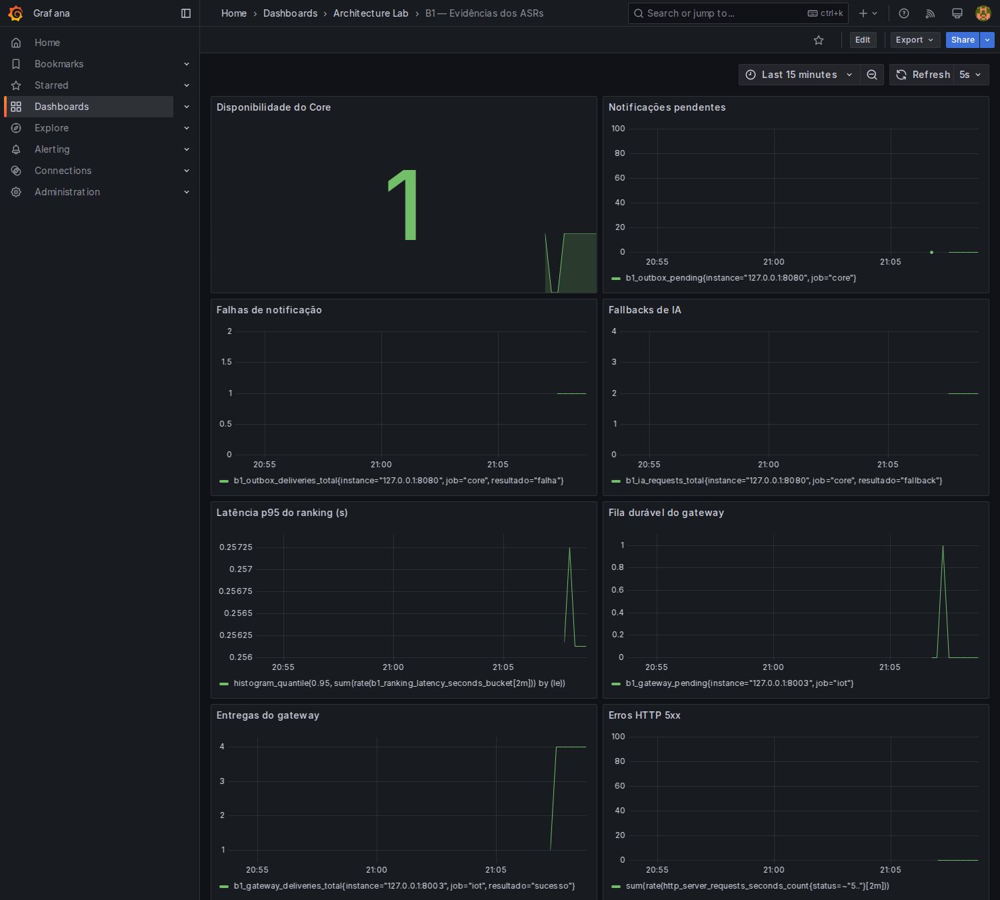
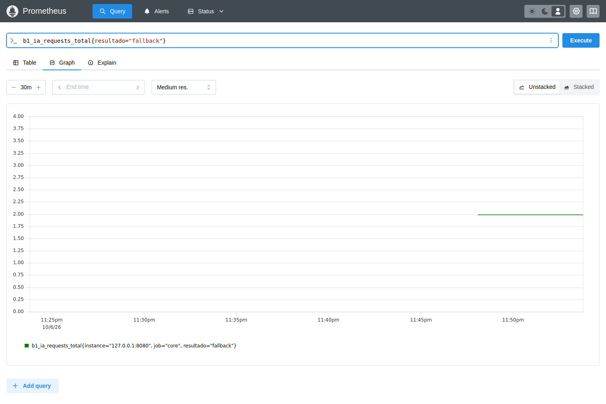
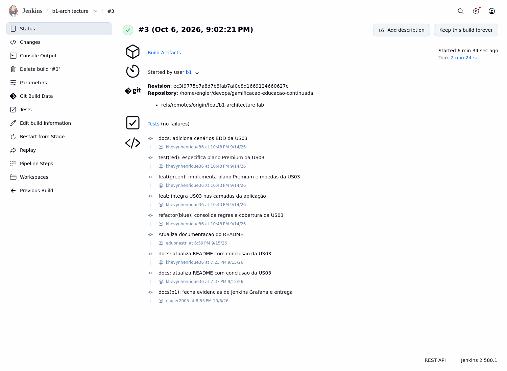
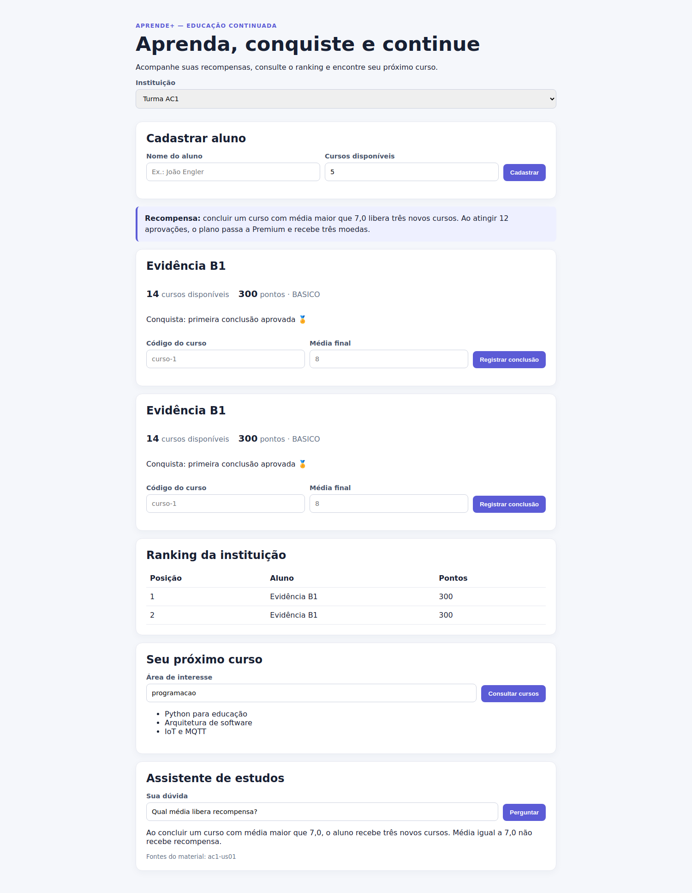

# Evidências reais do B1

Os arquivos são saídas dos testes e serviços executados, não exemplos de resultados. Cada microsolução tem uma hipótese descrita no ADR.

| Desafio | Evidência | Resultado |
| --- | --- | --- |
| 1 | [Dependências antes/depois](desafio1/dependencias.json), [ranking/carga](desafio1/ranking-carga.json) | Caso de uso deixa de importar JPA; resposta limitada sobre 100 mil registros H2. |
| 2 | [Testes e cobertura](desafio2/testes.json), [relatório HTML](desafio2/cobertura/index.html) | Contrato fake/JPA, domínio puro, concorrência e rollback; domínio com 100% linhas/branches. |
| 3 | [Interrupção real da IA](desafio3/falha-ia.json) | Core retorna fallback e mantém ranking; Python recupera. |
| 4 | [Síncrono/assíncrono e retomada](desafio4/falha-recuperacao.json) | Síncrono 503; real 200; evento/recompensa persistem após reiniciar Core e consumidor recebe depois. |
| 5 | [MQTT com gateway/Core offline](desafio5/mqtt-recuperacao.json) | Sessão/spool entregam após recuperação; reenvio não duplica recompensa. |
| 6 | [Consultas Prometheus/Grafana](desafio6/prometheus-grafana.json), [Jenkins](desafio6/jenkins.json) | Falha gera métricas e pendência; recuperação zera fila; pipeline valida código/configurações. |

## Capturas

## Reproduzir

Na raiz: `bash scripts/bootstrap-lab.sh`, `.venv/bin/python scripts/lab.py evidence`, `bash scripts/verify.sh`, `.venv/bin/python scripts/collect-test-evidence.py`.

As evidências capturadas registram horário/ambiente. Timings variam com host, cold start e ferramentas concorrentes. H2 não é benchmark PostgreSQL. O cenário tem 100 mil **registros** e 30 requisições sequenciais, não 100 mil usuários simultâneos.

Exportações `core-prometheus.txt` e `gateway-prometheus.txt`, logs e JSON permitem conferir capturas sem depender apenas de imagem. A execução do Jenkins declara explicitamente quais stages opcionais foram executados ou pulados.

