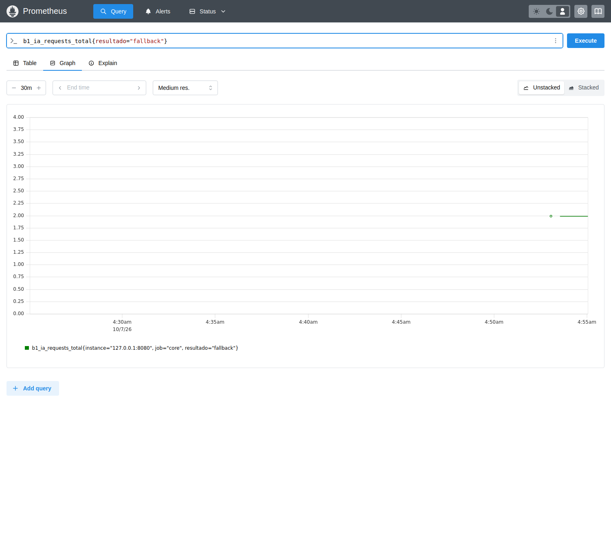
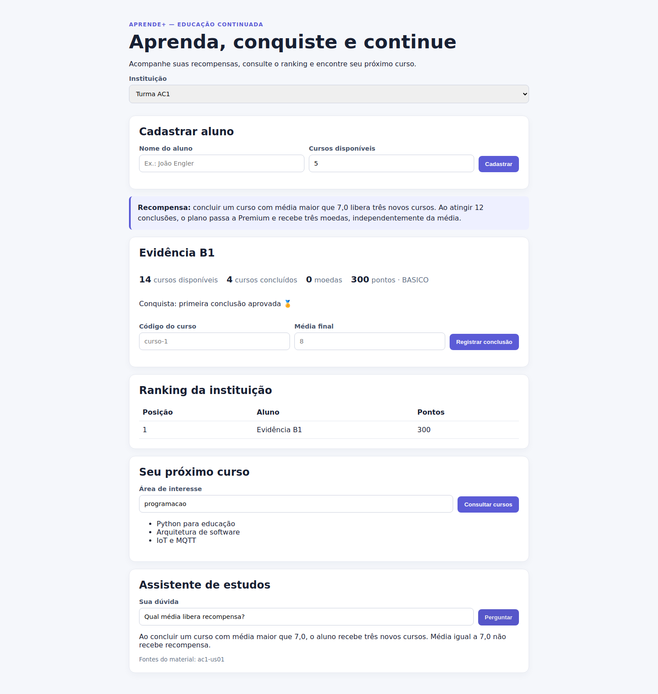

# Evidências do desafio 6 — Pipeline e operação observável

[Desafio e microsolução](../../../../labs/desafio6/README.md) · [Entrega principal](../../../arquitetura/README.md) · [Índice de evidências](../README.md)

## O que esta pasta comprova

Sustenta ASR-16/17/18, selecionados na matriz cumulativa. As saídas pertencem a testes/serviços executados e foram preservadas na reorganização; os horários, commits e limites estão nos registros originais.

| Arquivo/pasta | Como usar |
| --- | --- |
| [jenkins/jenkins.json](jenkins/jenkins.json) | Status, build, revisão Git, 29 testes sem falhas e stages Docker desabilitados. |
| [jenkins/jenkins-console.log](jenkins/jenkins-console.log) | Saída completa do pipeline real. |
| [jenkins/jenkins-plugins.json](jenkins/jenkins-plugins.json) | Manifesto do controller utilizado. |
| [monitoramento/prometheus-grafana.json](monitoramento/prometheus-grafana.json) | Queries reais, uma pendência durante a falha, zero após recuperação e dashboard com oito painéis. |
| [monitoramento/core-prometheus.txt](monitoramento/core-prometheus.txt) | Exportação bruta de métricas do Core. |
| [monitoramento/gateway-prometheus.txt](monitoramento/gateway-prometheus.txt) | Exportação bruta de métricas do gateway. |
| [capturas/](capturas/) | Quatro capturas reais: aplicação, Jenkins, Prometheus e Grafana. |
| [logs/](logs/) | Logs dos serviços da execução nativa. |

## Como interpretar

Leia primeiro o resultado do Jenkins, depois as queries de fallback/falha/entrega/pendência e as capturas. Counters reiniciam com o processo; os números pertencem à execução registrada. A recuperação é comprovada pelo resultado combinado dos desafios 4/5 e das métricas. Dockerfiles/stages estão configurados; seu deploy não foi executado neste ambiente.

## Reproduzir

Siga os comandos do [desafio correspondente](../../../../labs/desafio6/README.md). O [manifesto SHA-256](../manifesto-sha256.json) permite conferir a integridade dos arquivos.

## Capturas da execução

